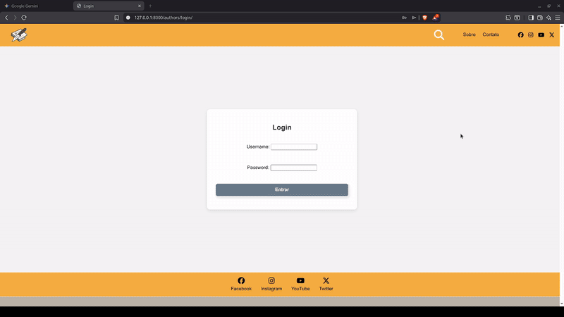

# 📰 EDC News — Django Blog Engine


O **EDC News** é um motor de blog moderno desenvolvido com **Django**, focado na **experiência de escrita do autor** e na **segurança rigorosa** do conteúdo publicado.

O sistema oferece uma interface de edição rica via **CKEditor 4** e uma camada robusta de **sanitização de HTML com Bleach**, garantindo que o portal seja imune a ataques de **XSS (Cross-Site Scripting)**, mesmo permitindo HTML customizado dos autores.

---

## 📸 Demonstração

|        ✍️ Editor Rico (CKEditor)         |           📱 Layout Mobile            |             📱 Layout Web             |
| :--------------------------------------: | :-----------------------------------: | :-----------------------------------: |
|  |  |  |
|      _Interface de escrita fluida_       |        _Adaptação para mobile_        |      _Adaptação para navegador_       |

---

## ✨ Funcionalidades Principal

- 📝 **Escrita Profissional:** Editor rico com CKEditor 4 (Suporte a negrito, listas, citações).
- 🖼️ **Gestão de Mídia:** Widget **Image2** para redimensionar, alinhar e legendar imagens visualmente.
- 🔒 **Segurança Ativa:** Sanitização automática de HTML no backend com **Bleach**.
- 👤 **Perfil de Autor:** Sistema customizado com foto de perfil, bio e integração com User Django.
- 📂 **Upload Validado:** Processamento de imagens com **Pillow** para garantir arquivos válidos.
- 📱 **Totalmente Responsivo:** Experiência otimizada para Desktop, Tablets e Smartphones.

---

## 🛠️ Editor de Conteúdo (CKEditor 4)

O núcleo do EDC News foi configurado para oferecer flexibilidade editorial sem quebrar o layout:

- **Widget Image2:** Manipulação avançada de imagens (drag-and-drop, resize dinâmico).
- **Colagem Inteligente:** Filtra automaticamente códigos "sujos" ao colar textos do **Word** ou **Google Docs**.
- **Toolbar Customizada:** Apenas as ferramentas essenciais para manter o foco na produtividade.

---

## 🔒 Segurança (Bleach Sanitization Engine)

O projeto implementa o conceito de **Defense in Depth**. O conteúdo não é apenas filtrado no navegador, mas "lavado" no servidor antes de tocar o banco de dados.

### Proteções implementadas:

1.  **Anti-XSS:** Remoção agressiva de tags `<script>`, `<iframe>` e atributos de evento (`onclick`, `onerror`).
2.  **Whitelist de HTML:** Apenas tags estruturais seguras são mantidas (`p`, `strong`, `img`, `h2`, etc).
3.  **Whitelist de CSS:** Somente propriedades visuais inofensivas são permitidas (`text-align`, `float`, `width`).
4.  **Sanitização no `model.save()`:** A limpeza ocorre automaticamente no backend, tornando o uso do filtro `|safe` nos templates totalmente seguro.

---

## ⚙️ Tecnologias Utilizadas

### **Backend**

- **Python 3.10+** & **Django 5.x**
- **Bleach:** Sanitização de HTML baseada no padrão HTML5.
- **Pillow:** Validação e processamento de imagens.

### **Frontend**

- **Django Templates:** Motor de renderização dinâmico.
- **CKEditor 4:** Edição rica com suporte a Widgets.
- **FontAwesome 6:** Iconografia profissional.
- **CSS Custom Properties:** Variáveis para design consistente.

---

## 🚀 Como Executar o Projeto

1. **Clone o repositório:**

   ```bash
   git clone [https://github.com/jdelta22/edcnews-djangoblog.git](https://github.com/jdelta22/edcnews-djangoblog.git)
   cd edcnews-djangoblog

   ```

2. **Crie e ative o ambiente virtual:**

python -m venv venv

# No Linux/Mac:

source venv/bin/activate

# No Windows:

venv\Scripts\activate

3. **Instale as dependências:**

```bash
pip install -r requirements.txt
```

4. **Prepare o Banco de Dados:**

```bash
python manage.py migrate
python manage.py createsuperuser
```

5. **Inicie o servidor:**

```bash
python manage.py runserver
```

    🔗 Acesse o site: http://127.0.0.1:8000

    🛠️ Painel Admin: http://127.0.0.1:8000/admin

## 📈 Roadmap / Melhorias Futuras

[ ] Comentários: Sistema de interação com moderação.

[ ] Busca: Implementação de busca Full-Text integrada.

[ ] Métricas: Dashboard de visualizações por notícia para autores.

[ ] DevOps: Deploy automatizado utilizando Docker & Nginx.

## 👨‍💻 Autor

Desenvolvido com ❤️ por João Pedro Calaça Costa

## 📄 Licença

Este projeto é open-source e pode ser utilizado como base para estudos e projetos pessoais.
